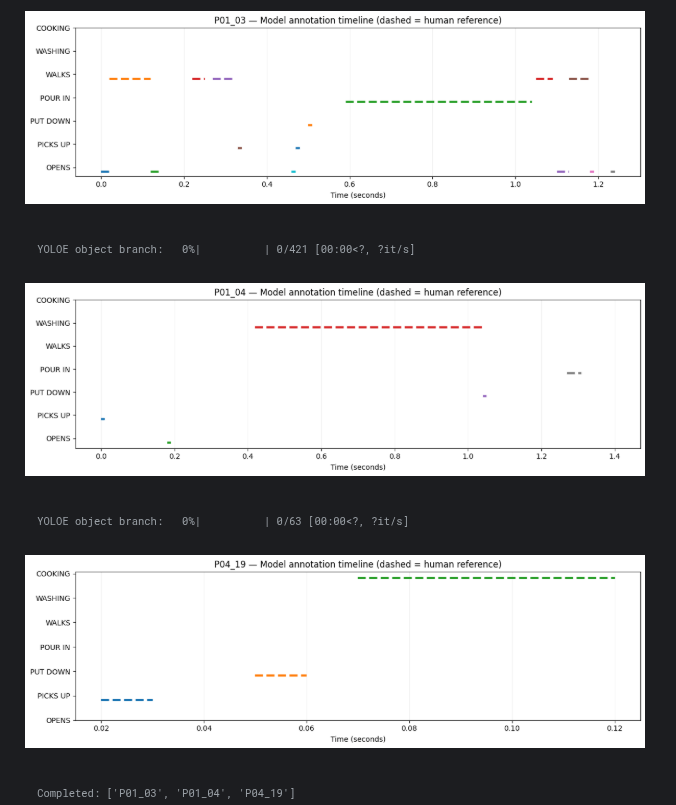
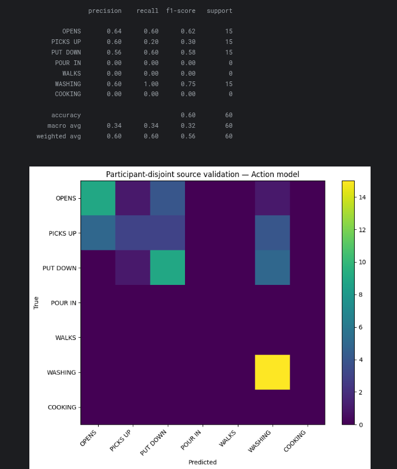
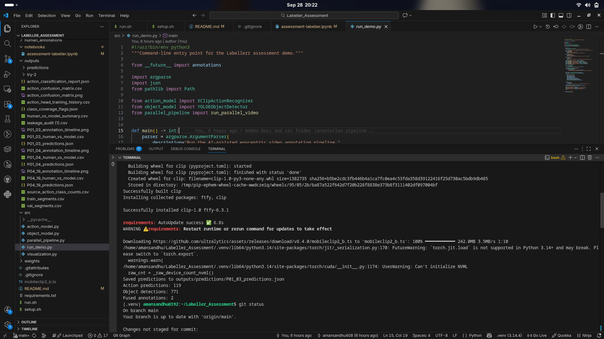
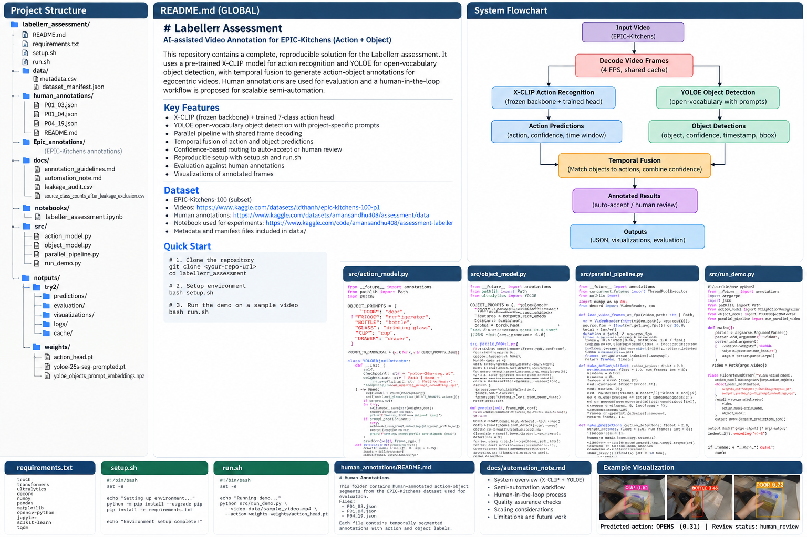

# Labellerr Assessment — POV: AI-Assisted Egocentric Video Annotation

> **Project:** semi-automated action + object annotation for egocentric video using frozen X-CLIP transfer learning, YOLOE open-vocabulary detection, temporal fusion, and human review.

## Summary Card

| Section | What I did | Confidence | Evidence |
|---|---|---:|---|
| Dataset | Accessed and skimmed 10 egocentric EPIC-KITCHENS clips and documented their metadata. | 5/5 | [`data/`](data/) · [Kaggle video subset](https://www.kaggle.com/datasets/ldthanh/epic-kitchens-100-p1) |
| Human labeling | Fully hand-labeled 3 clips with rough temporal action/object boundaries. | 5/5 | [`human_annotations/`](human_annotations/) |
| Leakage control | Audited the 10 assessment clip IDs against EPIC train/validation annotations and excluded P01/P04/P18 from supervised source training. | 5/5 | [`docs/leakage_audit.csv`](docs/leakage_audit.csv) |
| Action recognition | Frozen `microsoft/xclip-base-patch16` + small 7-class trainable head over cached features. | 4/5 | [`src/action_model.py`](src/action_model.py) · [`notebooks/labeller_assessment.ipynb`](notebooks/labeller_assessment.ipynb) |
| Object detection | YOLOE in open-vocabulary prompt mode for six project objects. | 4/5 | [`src/object_model.py`](src/object_model.py) |
| Parallel pipeline | One decoded frame stream feeds independent X-CLIP and YOLOE branches. | 4/5 | [`src/parallel_pipeline.py`](src/parallel_pipeline.py) |
| Fusion + routing | Temporally align action/object proposals, combine confidence, then route to auto-accept or human review. | 4/5 | [`src/parallel_pipeline.py`](src/parallel_pipeline.py) |
| Evaluation | Participant-disjoint source validation plus held-out human-reference comparison. | 3/5 | [`outputs/`](outputs/) · notebook |
| Automation proposal | One-page scale-up plan covering models, human-in-loop, quality checks, and time/cost estimation. | 5/5 | [`docs/automation_note.md`](docs/automation_note.md) |
| Reproducibility | Clean Unix setup and CLI preflight/inference entry point. | 4/5 | [`setup.sh`](setup.sh) · [`run.sh`](run.sh) |

## External links

- **Assessment annotation dataset:** https://www.kaggle.com/datasets/amansandhu408/assessment/data
- **EPIC-KITCHENS P1 video subset:** https://www.kaggle.com/datasets/ldthanh/epic-kitchens-100-p1
- **Kaggle assessment notebook:** https://www.kaggle.com/code/amansandhu408/assessment-labeller

## 1. What I built

The goal is not to replace annotators completely. The system generates machine proposals and uses confidence to decide which proposals can pass automatically and which should be reviewed by a person.

```text
Egocentric video
       │
       ▼
Decode once at 4 FPS
(shared timestamped frame stream)
       │
       ├───────────────────────────────┐
       ▼                               ▼
X-CLIP action branch              YOLOE object branch
       │                               │
       ▼                               ▼
action + confidence              object + confidence
+ temporal window                + timestamp + bbox
       │                               │
       └───────────────┬───────────────┘
                       ▼
                Temporal fusion
                       │
                       ▼
             Combined confidence
                       │
               ┌───────┴────────┐
               ▼                ▼
          High confidence   Low/ambiguous
               │                │
               ▼                ▼
          Auto-accept       Human review
               └───────┬────────┘
                       ▼
                Final JSON labels
```

For the assessment prototype, the action ontology is:

`OPENS`, `PICKS UP`, `PUT DOWN`, `POUR IN`, `WALKS`, `WASHING`, `COOKING`

The object ontology is:

`DOOR`, `FRIDGE`, `BOTTLE`, `GLASS`, `CUP`, `DRAWER`

## 2. Dataset and human labeling

Ten demonstration clips were accessed from an EPIC-KITCHENS-based source and catalogued in [`data/metadata.csv`](data/metadata.csv). The selected IDs are also recorded in [`data/dataset_manifest.json`](data/dataset_manifest.json).

Three clips were fully human-verified, which is above the two-clip requirement of the assessment:

- `P01_03.MP4`
- `P01_04.MP4`
- `P04_19.MP4`

The manually verified labels follow the project annotation rules in [`docs/annotation_guidelines.md`](docs/annotation_guidelines.md). Human labels are reference/evaluation data only and are not used for supervised training or validation.

## 3. Leakage control

The supplied EPIC-KITCHENS train/validation CSVs were checked against the exact ten demonstration video IDs before constructing the source training pool. The audit shows that the assessment participants `P01`, `P04`, and `P18` occur in the supplied official train or validation annotations, so those participants are excluded from the supervised source pool.

A second participant-grouped split is then created for the remaining source data so a participant does not appear in both model training and validation.

See [`docs/leakage_audit.csv`](docs/leakage_audit.csv) and [`docs/source_class_counts_after_leakage_exclusion.csv`](docs/source_class_counts_after_leakage_exclusion.csv).

## 4. Action recognition

The notebook uses `microsoft/xclip-base-patch16` as a frozen video representation and trains only a small classification head over cached X-CLIP features. Each action sample uses 8 frames from a temporal segment; the source-video pilot is capped per class so the experiment remains practical on a single GPU.

The executed pilot produced 163 training feature vectors and 60 validation feature vectors. Because `POUR IN`, `WALKS`, and `COOKING` are absent from the participant-disjoint validation sample, the reported 60% accuracy and 0.32 macro F1 should be interpreted only as a small pilot result over the represented validation classes, not as a full 7-class benchmark.

The complete validation report and confusion matrix are generated by the notebook.

## 5. Object detection

YOLOE is used in open-vocabulary mode. The six prompts are:

```text
 door
 refrigerator
 bottle
 drinking glass
 cup
 drawer
```

The detector output is mapped back to the canonical project ontology and retains confidence and bounding-box coordinates. No project-specific object fine-tuning is claimed.

## 6. Why the four source modules exist

### `src/action_model.py`

Owns action recognition. It loads the trained X-CLIP head checkpoint, keeps the X-CLIP backbone frozen, and exposes single-window or batched prediction with the action confidence and full class probabilities.

### `src/object_model.py`

Owns object detection. It loads YOLOE, configures the six text prompts, and returns canonical object names, confidence scores, and bounding boxes.

### `src/parallel_pipeline.py`

Owns orchestration. It decodes the video once, creates temporal action windows, schedules the independent action/object branches over the shared frame data, temporally associates object detections with action windows, computes the combined confidence, and assigns the review status.

The branches may share the same GPU, so the code does **not** claim that CUDA kernels are guaranteed to execute simultaneously. The engineering benefit is the shared decode and independent branch structure.

### `src/run_demo.py`

Owns command-line execution. It loads the two models, runs the complete pipeline on one video, and writes a machine-readable prediction file to `outputs/predictions/`.

## 7. Fusion and human-in-the-loop

The final reusable pipeline uses:

- action candidate threshold: `0.30`
- object detection threshold: `0.25`
- temporal association tolerance: `±0.25 s`
- auto-accept threshold for combined confidence: `0.85`

Action-only candidates are retained rather than silently discarded and are sent to human review. This is important because the absence of a detected object does not prove that no meaningful action occurred.

For action-object matches, the prototype combines confidence using the geometric mean:

```text
combined_confidence = sqrt(action_confidence × object_confidence)
```

The final JSON keeps the individual confidence values visible so a reviewer can understand why an annotation was routed.

## 8. Evaluation and what the pilot shows

The notebook evaluates the automation against the three held-out human-verified clips. The reference labels are loaded only after model construction.

The conservative baseline fusion pass on the three human clips produced no temporally matched fused annotations, so the corresponding agreement metrics were zero. The notebook therefore performs an additional threshold-sensitivity experiment on two clips using the lower action-candidate threshold and a small temporal tolerance. In that experiment:

- `P01_03`: 119 action predictions + 771 object detections → 2 fused proposals; both were `human_review`.
- `P01_04`: 105 action predictions + 583 object detections → 47 fused proposals; all were `human_review`.

No observed proposal in that threshold experiment crossed the `0.85` auto-accept threshold.

These results are useful as a workflow diagnostic: they show that the current action model needs better calibration/temporal alignment before an automatic-accept queue would be trusted at scale. The point of the assessment prototype is the end-to-end annotation design and human-in-the-loop workflow, not a claim of production accuracy.

## 9. Visualizations & Execution Evidence

### Human vs. Model Temporal Annotations

The notebook displays reviewer-oriented temporal timelines for the three human-verified clips. Dashed intervals represent the human reference annotations, while solid intervals represent model-generated proposals.



### Action Model Validation

The participant-disjoint validation results include the per-class classification report and confusion matrix. The sparse classes are explicitly retained rather than hidden from the evaluation.



### Local End-to-End Pipeline Test

The modular pipeline was also tested locally through the command-line entry point after installing the repository environment. The test verifies the reusable source modules and the generated prediction output.



The same visualization workflow can be reproduced using the helper in [`src/visualization.py`](src/visualization.py). Generated experiment outputs belong under `outputs/visualizations/`.

The repository-level system flowchart is available here:



A Mermaid version is also available in [`docs/flowchart.md`](docs/flowchart.md).

## 10. Automation at scale

The full one-page proposal is in [`docs/automation_note.md`](docs/automation_note.md). The central operating model is:

```text
AI proposes → confidence routes → humans verify → verified corrections become feedback
```

The note defines measurable human-effort savings rather than claiming unmeasured production savings. An illustrative example is included and is explicitly marked as hypothetical.

## 11. Repository structure

```text
labellerr_assessment/
├── README.md
├── requirements.txt
├── setup.sh
├── run.sh
│
├── data/
│   ├── metadata.csv
│   └── dataset_manifest.json
│
├── human_annotations/
│   ├── P01_03.json
│   ├── P01_04.json
│   ├── P04_19.json
│   └── README.md
│
├── EPIC_annotations/
│   ├── EPIC_100_train.csv
│   ├── EPIC_100_validation.csv
│   ├── EPIC_100_test_timestamps.csv
│   ├── EPIC_100_verb_classes.csv
│   └── EPIC_100_noun_classes.csv
│
├── docs/
│   ├── annotation_guidelines.md
│   ├── automation_note.md
│   ├── flowchart.md
│   ├── system_flowchart.png
│   ├── KAGGLE_SETUP.md
│   ├── leakage_audit.csv
│   └── source_class_counts_after_leakage_exclusion.csv
│
├── notebooks/
│   └── labeller_assessment.ipynb
│
├── src/
│   ├── action_model.py
│   ├── object_model.py
│   ├── parallel_pipeline.py
│   ├── visualization.py
│   └── run_demo.py
│
├── outputs/
│   ├── predictions/
│   ├── evaluation/
│   ├── visualizations/
│   └── logs/
│
└── weights/
    └── README.md
```

Raw EPIC-KITCHENS video files are not committed to the repository.

## 12. Quick start on Unix

### Clone the repository

```bash
git clone https://github.com/amansandhu408/Labeller_Assessment.git
cd Labeller_Assessment
```

### Set up Environment

```bash
chmod +x setup.sh run.sh
./setup.sh
```

Activate the virtual environment:
```bash
source .venv/bin/activate
```

### Repository preflight

```bash
./run.sh
```

This compiles the source modules and checks the CLI entry point without requiring the full video dataset.

### Run the modular demo

After generating or supplying the trained action-head checkpoint:

```bash
./run.sh path/to/video.mp4
```

or:

```bash
./run.sh path/to/video.mp4 path/to/action_head.pt
```

Predictions are written by default to:

```text
outputs/predictions/<video>_predictions.json
```

The full training/evaluation experiment is captured in [`notebooks/labeller_assessment.ipynb`](notebooks/labeller_assessment.ipynb) and is available through the linked Kaggle notebook.

## 13. Approximate time breakdown

The assessment asks for rough section timing rather than exact stopwatch records. The current self-estimated breakdown is:

| Section | Approx. time |
|---|---:|
| Dataset access + inspection | ~30 min |
| Human annotation | ~20-25 min |
| Modeling + automation prototype | ~120 min |
| Evaluation + visualization | ~30 min |
| Packaging + documentation | ~20 min |
| **Total** | **~3 hr 45 min** |

## 14. Reflection

### Q1: What would you improve about your submission if you had two more hours?

With two additional hours, I would expand the evaluation to a larger participant-held-out subset and measure action and object performance with precision, recall, macro F1, and temporal overlap on more reference annotations. I would also investigate the temporal displacement seen in the current demo and calibrate the confidence-routing thresholds on held-out data. Finally, I would add a lightweight review interface where a reviewer could correct labels and timestamps directly from representative frames.

### Q2: What's one thing about this task you didn't already know how to do, and how did you figure it out?

I had not previously built an end-to-end video-labeling workflow that combined a pretrained video model, open-vocabulary object detection, temporal fusion, and confidence-based human review. I learned how to separate the components into independent model branches, share one decoded frame stream, and produce a common annotation schema. I worked through the model documentation and implementation details, then validated the design by running it on real egocentric clips and inspecting the resulting predictions and failure cases.

## 15. Scope and limitations

This repository is an assessment-scale prototype. The action ontology is a deliberate project-level mapping of EPIC-KITCHENS verbs rather than a claim of perfect semantic equivalence. Several actions are sparse after leakage exclusion and physical-video filtering, and YOLOE is zero-shot for the project objects. Those limitations are retained explicitly because they are useful signals for the next engineering iteration.
