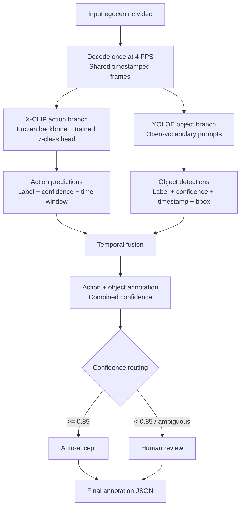

## System Flow

```mermaid
flowchart TD
    A[Input egocentric video] --> B[Decode once at 4 FPS<br/>Shared timestamped frames]

    B --> C[X-CLIP action branch<br/>Frozen backbone + trained 7-class head]
    B --> D[YOLOE object branch<br/>Open-vocabulary prompts]

    C --> E[Action predictions<br/>Label + confidence + time window]
    D --> F[Object detections<br/>Label + confidence + timestamp + bbox]

    E --> G[Temporal fusion]
    F --> G

    G --> H[Action + object annotation<br/>Combined confidence]

    H --> I{Confidence routing}

    I -->|>= 0.85| J[Auto-accept]
    I -->|< 0.85 / ambiguous| K[Human review]

    J --> L[Final annotation JSON]
    K --> L
```